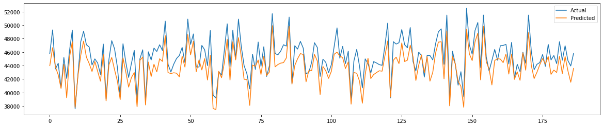

# Samsung Stock Price Prediction

## Aim:
Predict Samsung Stock Price using machine learning techniques.

## Models Used:
- **GRU** (Gated Recurrent Unit) for time series forecasting.

This repository implements a model for predicting the stock prices of Samsung using historical data. The model uses GRU to capture the temporal dependencies in the stock price data, helping make accurate predictions.

Feel free to explore and experiment with the provided code for your own use case. 📈
